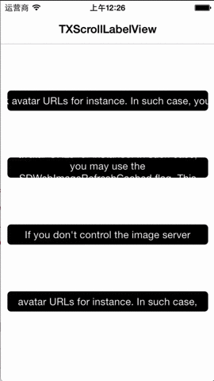

# TXScrollLabelView

`TXScrollLabelView` is an iOS class that displays a adverts or boardcast e.g. with an view.

### Usage 

example :

        NSString *scrollTitle = @"xxxxxxxx";
        //options 是 TXScrollLabelViewType 枚举， 此处为了方便举例
        TXScrollLabelView *scrollLabelView = [TXScrollLabelView tx_setScrollTitle:scrollTitle scrollType:options scrollVelocity:1.0 options:UIViewAnimationOptionCurveEaseInOut];
        
        //布局
        scrollLabelView.frame = CGRectMake(50, 100 * (options + 0.7), 300, 44);
        scrollLabelView.tx_centerX = [UIScreen mainScreen].bounds.size.width * 0.5;
        
        //偏好设置
        scrollLabelView.scrollInset = UIEdgeInsetsMake(0, 10 , 0, 10);
        scrollLabelView.scrollSpace = 10;
        scrollLabelView.font = [UIFont systemFontOfSize:15];
        scrollLabelView.textAlignment = NSTextAlignmentCenter;
        scrollLabelView.backgroundColor = [UIColor blackColor];
        scrollLabelView.layer.cornerRadius = 5;
        [self.view addSubview:scrollLabelView];
        
        //开始滚动
        [scrollLabelView beginScrolling];
        self.scrollLabelView = scrollLabelView;
        
        
You can running **demo** for more details.

