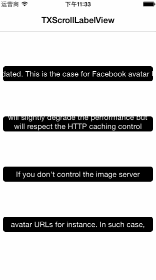

 

  

        

`TXScrollLabelView` is an iOS class that displays a adverts or boardcast e.g. with an view.([中文版](http://www.jianshu.com/p/8f1f1b1ee814))

## Support what kinds of scrollType

- **TXScrollLabelViewTypeLeftRight** : scrolling from right to left, and cycle all contents(`scrollTitle`) in a single line.

- **TXScrollLabelViewTypeUpDown**: scrolling from bottom to top, and cycle all contents.

- **TXScrollLabelViewTypeFlipRepeat**: scrolling from bottom to top, and cycle the first line of your contents.

- **TXScrollLabelViewTypeFlipNoRepeat**: scrolling from bottom to top, and cycle all contents with a line once times.

And `scrollVelocity` property now supports all above enum of `TXScrollLabelViewType`, just enjoy it!

## Installation

There are two ways to use TXScrollLabelView in your project:

* Using CocoaPods

* By cloning the project into your repository

* Using Carthage (not support now)

### Installation with CocoaPods
    
CocoaPods is a dependency manager for Objective-C, which automates and simplifies the process of using 3rd-party libraries in your projects. 

**Podfile**

    platform :ios, '7.0'
    pod 'TXScrollLabelView'

### Installation with Manual

* Drag **ALL** files in the TXScrollLabelView folder to project

* Import the main file：
    
        #import "TXScrollLabelView.h”
    
## Usage 

**Objective-C example :**

    /** Step1: 滚动文字 */
    NSString *scrollTitle = @"xxxxxx";
    
    /** Step2: 创建 ScrollLabelView */
    TXScrollLabelView *scrollLabelView = [TXScrollLabelView scrollWithTitle:scrollTitle type:TXScrollLabelViewTypeFlipNoRepeat velocity:velocity options:UIViewAnimationOptionCurveEaseInOut];
    
    /** Step3: 设置代理进行回调(Optional) */
    scrollLabelView.scrollLabelViewDelegate = self;
    
    /** Step4: 布局(Required) */
    scrollLabelView.frame = CGRectMake(50, 100, 300, 30);
    [self.view addSubview:scrollLabelView];
    
    /** Step5: 开始滚动(Start scrolling!) */
    [scrollLabelView beginScrolling];
        
        
You can running **TXScrollLabelViewDemo** for more details.

**Swift example :** Producting.([**Swift-version**](https://github.com/tingxins/ScrollLabelView))

## Communication

Absolutely，you can contribute to this project all the time if you want to.

- If you **need help or ask general question**, just [**@tingxins**](http://weibo.com/tingxins) in `Weibo` or `Twitter`, ofcourse, you can access to my [**blog**](https://tingxins.com).

- If you **found a bug**, just open an issue.

- If you **have a feature request**, just open an issue.

- If you **want to contribute**, fork this repository, and then submit a pull request.

## License

`TXScrollLabelView` is available under the MIT license. See the LICENSE file for more info.

